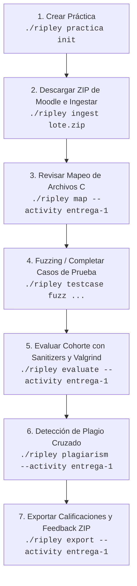

# Manual de Usuario y Referencia Técnica de Ripley CLI

`ripley` es una herramienta de línea de comandos en Python (gestionada con `uv`) diseñada para automatizar la ingesta, versionado incremental, compilación segura, análisis estático/AST, ejecución dinámica, auditoría de memoria y calificación de entregas masivas de Moodle en C para la materia **Programación I**.

---

## Índice

1. [Requisitos y Configuración de Entorno](#1-requisitos-y-configuración-de-entorno)
2. [Flujo de Trabajo Docente Recomendado](#2-flujo-de-trabajo-docente-recomendado)
3. [Estructura del Proyecto y Archivos de Configuración](#3-estructura-del-proyecto-y-archivos-de-configuración)
4. [Referencia Completa de Comandos CLI](#4-referencia-completa-de-comandos-cli)
   - [4.1 Ingesta y Sanitización (`ingest`)](#41-ingesta-y-sanitización-ingest)
   - [4.2 Gestión de Prácticas Docentes (`practica`)](#42-gestión-de-prácticas-docentes-practica)
   - [4.3 Mapeo de Archivos Fuente (`map` / `testcase map`)](#43-mapeo-de-archivos-fuente-map--testcase-map)
   - [4.4 Gestión y Esqueletos de Casos de Prueba (`testcase`)](#44-gestión-y-esqueletos-de-casos-de-prueba-testcase)
   - [4.5 Fuzzing y Generación de Casos de Prueba (`testcase fuzz`)](#45-fuzzing-y-generación-de-casos-de-prueba-testcase-fuzz)
   - [4.6 Evaluación Integral de Entregas (`evaluate`)](#46-evaluación-integral-de-entregas-evaluate)
   - [4.7 Análisis de Plagio y Similitud (`plagiarism`)](#47-análisis-de-plagio-y-similitud-plagiarism)
   - [4.8 Linters de Calidad, AST y Buenas Prácticas (`lint`)](#48-linters-de-calidad-ast-y-buenas-prácticas-lint)
   - [4.9 Auditoría de Funciones Puras (`pure-audit`)](#49-auditoría-de-funciones-puras-pure-audit)
   - [4.10 Simulador de Fragmentación de Memoria Heap (`heap-simulate`)](#410-simulador-de-fragmentación-de-memoria-heap-heap-simulate)
   - [4.11 Emulación de Memoria Embebida Restringida (`embedded-test`)](#411-emulación-de-memoria-embebida-restringida-embedded-test)
   - [4.12 Diagramas de Flujo Tradicionales ISO/ANSI (`flowchart`)](#412-diagramas-de-flujo-tradicionales-isoansi-flowchart)
   - [4.13 Árboles de Llamadas Call Graph (`callgraph`)](#413-árboles-de-llamadas-call-graph-callgraph)
   - [4.14 Visualizador de Estructuras Dinámicas en Memoria (`memory-visualize`)](#414-visualizador-de-estructuras-dinámicas-en-memoria-memory-visualize)
   - [4.15 Generador de Mocks en C (`mock generate`)](#415-generador-de-mocks-en-c-mock-generate)
   - [4.16 Testing Basado en Propiedades (`property-test`)](#416-testing-basado-en-propiedades-property-test)
   - [4.17 Auditoría de Documentación Doxygen (`doxygen`)](#417-auditoría-de-documentación-doxygen-doxygen)
   - [4.18 Gestión de Plantillas Jinja2 (`template`)](#418-gestión-de-plantillas-jinja2-template)
   - [4.19 Exportación a Moodle y Tablero Docente (`export`)](#419-exportación-a-moodle-y-tablero-docente-export)
5. [Diagnósticos Especializados y Sanitizadores](#5-diagnósticos-especializados-y-sanitizadores)
6. [Estructura del Archivo de Configuración `ripley.toml`](#6-estructura-del-archivo-de-configuración-ripleytoml)

---

## 1. Requisitos y Configuración de Entorno

### Dependencias del Sistema
- **Python:** 3.11 o superior.
- **Gestor de Entorno:** `uv` (Fast Python package installer).
- **Herramientas de Compilación y Diagnóstico:** `gcc`, `valgrind`, `graphviz` (`dot`).

### Inicialización
```bash
# Sincronizar el entorno virtual con uv
uv sync

# Ejecutar ripley mediante el wrapper
./ripley --help
```

---

## 2. Flujo de Trabajo Docente Recomendado



---

## 3. Estructura del Proyecto y Archivos de Configuración

```text
workspace/
├── ripley.toml                       # Configuración global de compilación, linter, estilo y rúbricas
├── templates/                        # Plantillas Jinja2 para generar reportes Markdown
│   ├── header.jinja2.md
│   ├── version_section.jinja2.md
│   └── footer.jinja2.md
├── practicas/                        # Repositorio de prácticas estructuradas de la cátedra
│   └── practica-1-punteros_1228009/
│       ├── ripley.toml
│       ├── enunciado.md
│       ├── pautas_evaluacion.md
│       └── ejercicios/
│           ├── ejercicio1/
│           │   ├── enunciado.md
│           │   ├── solucion_modelo.c
│           │   └── tests/ (caso1.in, caso1.out, caso1.argv)
├── tests/                            # Casos de prueba sincronizados por actividad
│   └── entrega-1_1228009/
│       └── ejercicio1/
└── entrega-1_1228009/                 # Entregas procesadas por estudiante
    ├── dashboard.md                  # Reporte consolidado de la cohorte
    ├── moodle_grades.csv             # CSV listo para importar en Moodle
    ├── retroalimentacion_moodle.zip  # ZIP con informes Markdown por alumno
    └── perez-juan_123456/
        ├── .metadata.db              # Base SQLite con notas, revisiones y hashes
        ├── mapping.json              # Mapeo persistente de archivos C a ejercicios
        └── r1/                       # Fuentes C de la primera entrega
```

---

## 4. Referencia Completa de Comandos CLI

### 4.1 Ingesta y Sanitización (`ingest`)
Procesa un archivo ZIP descargado directamente de Moodle. Normaliza codificaciones a UTF-8, aplana subcarpetas accidentales, filtra binarios no permitidos y calcula hashes SHA-256 para evitar reprocesar reentregas idénticas.

```bash
./ripley ingest <archivo_moodle.zip> [--dry-run]
```

**Opciones:**
- `<archivo_moodle.zip>`: Ruta al archivo comprimido exportado de Moodle.
- `--dry-run`: Simula la ingesta mostrando en consola la estructura resultante sin escribir en disco.

---

### 4.2 Gestión de Prácticas Docentes (`practica`)
Gestiona el ciclo de vida de enunciados, pautas, rúbricas y casos de prueba docentes dentro de `./practicas/`.

#### `practica init`
Crea interactivamente o por parámetros la estructura completa de una nueva práctica:
```bash
./ripley practica init \
  --name "Práctica 1 - Punteros" \
  --activity-id "1228009" \
  --exercises "ejercicio1,ejercicio2" \
  --cases-per-exercise 3 \
  --with-argv
```
**Opciones:**
- `--name`, `-n`: Nombre de la práctica (ej. "Práctica 2 - Memoria Dinámica").
- `--activity-id`, `-i`: ID de la actividad de Moodle.
- `--exercises`, `-e`: Lista separada por comas de slugs de ejercicios.
- `--cases-per-exercise`, `-c`: Cantidad de casos de prueba iniciales por ejercicio (por defecto: `2`).
- `--with-argv`: Genera archivos `.argv` para pasar argumentos de línea de comandos.
- `--force`, `-f`: Sobrescribe una práctica existente si ya fue inicializada.

#### `practica list`
Muestra una tabla con todas las prácticas registradas en `./practicas/`, el estado de sus enunciados, soluciones de referencia y cantidad de tests:
```bash
./ripley practica list [--path practicas]
```

#### `practica sync`
Sincroniza los casos de prueba docentes desde `./practicas/<slug>/ejercicios/<ej>/tests/` hacia `./tests/<slug>/`:
```bash
./ripley practica sync --activity "practica-1-punteros_1228009"
```

---

### 4.3 Mapeo de Archivos Fuente (`map` / `testcase map`)
Asocia los archivos `.c` entregados por los alumnos con los ejercicios y casos de prueba correspondientes.

```bash
./ripley map --activity <slug_actividad> [--student <slug_alumno>] [--unmapped-only/--all/--auto]
```

**Opciones:**
- `--activity`, `-a`: Slug del directorio de la actividad (ej. `entrega-1_1228009`).
- `--student`, `-s`: Filtra la revisión a un único estudiante específico.
- `--unmapped-only`: (Por defecto) Muestra únicamente archivos que no pudieron vincularse automáticamente.
- `--all`: Revisa interactivamente todos los archivos de la cohorte.
- `--auto`: Aplica heurísticas de similitud de texto sin solicitar confirmación manual.

---

### 4.4 Gestión y Esqueletos de Casos de Prueba (`testcase`)

#### `testcase skeleton`
Crea plantillas vacías `.in`, `.out` y `.argv` para un ejercicio:
```bash
./ripley testcase skeleton --activity "entrega-1" --exercise "ejercicio1" --cases 5 --with-argv
```

#### `testcase list`
Lista todos los casos de prueba configurados por actividad y ejercicio:
```bash
./ripley testcase list [--activity <actividad>]
```

#### `testcase check`
Audita que no existan entradas `.in` sin sus correspondientes salidas `.out` esperadas:
```bash
./ripley testcase check [--activity <actividad>]
```

---

### 4.5 Fuzzing y Generación de Casos de Prueba (`testcase fuzz`)
Genera casos de borde aleatorios (`INT_MAX`, `INT_MIN`, cadenas de caracteres vacías o gigantes, números negativos) y calcula las salidas `.out` esperadas ejecutando la solución modelo docente:

```bash
./ripley testcase fuzz \
  --activity "entrega-1_1228009" \
  --exercise "ejercicio1" \
  --reference-source "./practicas/entrega-1/ejercicios/ejercicio1/solucion_modelo.c" \
  --count 10
```

---

### 4.6 Evaluación Integral de Entregas (`evaluate`)
Orquesta la compilación modular por mapeo, cálculo de diff semántico AST, análisis de estilo, linters, pruebas de ejecución dinámica, sanitizadores UBSan/ASan y auditoría de memoria con Valgrind:

```bash
./ripley evaluate --activity "entrega-1_1228009" [--parallel/--no-parallel] [--check-plagiarism]
```

**Opciones:**
- `--activity`, `-a`: Slug de la actividad a evaluar.
- `--parallel / --no-parallel`: Ejecuta la evaluación en paralelo utilizando todos los núcleos del CPU.
- `--check-plagiarism`: Dispara el análisis cruzado de plagio tras finalizar la evaluación individual.

---

### 4.7 Análisis de Plagio y Similitud (`plagiarism`)
Calcula coeficientes de similitud estructural (Jaccard y Contención) entre todas las entregas mediante tokenización AST de C y algoritmo **Winnowing**:

```bash
./ripley plagiarism \
  --activity "entrega-1_1228009" \
  --threshold 0.70 \
  --output "plagiarism_report.md"
```

**Opciones:**
- `--threshold`, `-t`: Umbral de similitud mínima para emitir alerta (ej. `0.70` = 70%).
- `--output`, `-o`: Archivo Markdown donde guardar el informe de coincidencias sospechosas.

---

### 4.8 Linters de Calidad, AST y Buenas Prácticas (`lint`)
Audita el cumplimiento de buenas prácticas en C:

```bash
./ripley lint --file entregas/alumno_1/r1/ejercicio1.c [OPCIONES]
```

**Opciones:**
- `--file`, `-f`: Archivo C a analizar.
- `--magic-numbers / --no-magic-numbers`: Literales numéricos sin nombre fuera de `#define`/`enum`.
- `--clones / --no-clones`: Detección de bloques de código duplicados (copy-paste) dentro del mismo archivo.
- `--naming / --no-naming`: Convenciones de nombres (`snake_case`, constantes en `UPPER_CASE`, prefijo `t_`).
- `--dead-code / --no-dead-code`: Funciones inalcanzables desde `main()` y código posterior a `return`/`exit()`.
- `--doxygen / --no-doxygen`: Verificación de comentarios `@brief`, `@param` y `@return`.
- `--advanced / --no-advanced`: Habilita los 9 linters avanzados de AST:
  1. *Comparación de Punto Flotante:* `a == b` en `float`/`double`.
  2. *Inclusiones Innecesarias (IWYU):* `#include <math.h>` sin usar sus funciones.
  3. *Const-Correctness:* Punteros de solo lectura no calificados con `const`.
  4. *Efectos Colaterales en Cortocircuito:* `if (a && b++)`.
  5. *Deep Free Verifier:* `free(nodo)` sin liberar campos puntero anidados.
  6. *Punteros Nulos en `<string.h>`:* `strlen(s)` sin validar `if (s != NULL)`.
  7. *Variable Shadowing:* Variables locales que ocultan parámetros.
  8. *Dangling Stack Pointer Return:* `return &local_var;` (severidad `ERROR`).
  9. *Sobre-Ingeniería:* Intercambios XOR (`a ^= b`) y ternarios triplemente anidados.
  10. *Orden de Evaluación de Argumentos:* Modificación y lectura simultánea en parámetros `f(i++, i++)`.
  11. *Escritura en `.rodata`:* `char *s = "hola"; s[0] = 'X';`.
  12. *Saltos Hacia Atrás con `goto`:* Saltos a etiquetas previas (*spaghetti loops*).

---

### 4.9 Auditoría de Funciones Puras (`pure-audit`)
Verifica estáticamente y mediante GCC con inyección de atributos que las funciones cumplan con los contratos `__attribute__((pure))` o `__attribute__((const))`:

```bash
./ripley pure-audit --file programa.c --mode const [--verify-compiler]
```

**Opciones:**
- `--file`, `-f`: Archivo fuente en C.
- `--mode`, `-m`: `pure` (sin efectos secundarios ni mutaciones de memoria global) o `const` (depende únicamente de sus argumentos escalares y no lee punteros ni memoria global).
- `--verify-compiler`: Inyecta el atributo en una copia temporal y compila con GCC bajo `-O2 -Werror`.

---

### 4.10 Simulador de Fragmentación de Memoria Heap (`heap-simulate`)
Simula asignaciones y liberaciones de memoria en un montículo con coalescencia contigua automática para diagnosticar fragmentación externa:

```bash
./ripley heap-simulate \
  --capacity 2048 \
  --allocations "128,512,64,256,128" \
  --frees "2,4"
```

**Opciones:**
- `--capacity`, `-c`: Capacidad del Heap simulado en bytes.
- `--allocations`, `-a`: Lista de tamaños a asignar separados por comas.
- `--frees`, `-f`: Índices 1-based de las asignaciones que se liberan.

---

### 4.11 Emulación de Memoria Embebida Restringida (`embedded-test`)
Ejecuta el binario compilado bajo límites estrictos de memoria física (`RLIMIT_AS` y `RLIMIT_DATA`) para verificar sistemas con recursos ultra reducidos (microcontroladores o RTOS):

```bash
./ripley embedded-test --binary ./binario_alumno --limit-kb 64 --stdin "10 20"
```

**Opciones:**
- `--binary`, `-b`: Ruta al ejecutable compilado.
- `--limit-kb`, `-l`: Límite máximo de memoria en Kilobytes (por defecto: `64` KB).
- `--stdin`: Datos provistos por la entrada estándar.

---

### 4.12 Diagramas de Flujo Tradicionales ISO/ANSI (`flowchart`)
Genera diagramas de flujo con la simbología estándar (óvalos de inicio/fin, paralelogramos de E/S, rombos de decisión y rectángulos de asignación):

```bash
./ripley flowchart --file programa.c --format mermaid [--output diagrama.md]
```

**Opciones:**
- `--file`, `-f`: Archivo C con las funciones a diagramar.
- `--function`: Nombre de la función específica a graficar (si se omite, grafica `main()`).
- `--format`: `mermaid` (renderizable en Markdown) o `dot` (Graphviz).
- `--output`, `-o`: Guarda el resultado en un archivo en lugar de imprimirlo por pantalla.

---

### 4.13 Árboles de Llamadas Call Graph (`callgraph`)
Genera el grafo de dependencias e invocaciones entre funciones del programa:

```bash
./ripley callgraph --file programa.c --format dot --stdlib [--output callgraph.dot]
```

**Opciones:**
- `--file`, `-f`: Archivo fuente en C.
- `--format`: `mermaid` o `dot`.
- `--stdlib`: Incluye las invocaciones a funciones de la biblioteca estándar (`printf`, `malloc`, `free`, etc.).

---

### 4.14 Visualizador de Estructuras Dinámicas en Memoria (`memory-visualize`)
Extrae las definiciones de `struct` y genera la topología de memoria y enlaces de punteros (listas enlazadas, árboles binarios, grafos):

```bash
./ripley memory-visualize --file estructuras.c --format mermaid
```

---

### 4.15 Generador de Mocks en C (`mock generate`)
Genera automáticamente stubs y arneses mock (`mock_<modulo>.h` y `.c`) a partir de un header C para pruebas unitarias docentes:

```bash
./ripley mock generate --header modulo.h --output-dir tests/mocks/
```

Genera:
- `mock_<fn>_call_count`: Contador de llamadas a cada función simulada.
- `mock_<fn>_set_return(...)`: Inyector de valores de retorno simulados.
- `reset_all_mocks()`: Reseteo de contadores para aislamiento entre tests.

---

### 4.16 Testing Basado en Propiedades (`property-test`)
Valida invariantes formales en funciones C ejecutando iteraciones con datos pseudoaleatorios y reportando contraejemplos mínimos:

```bash
./ripley property-test \
  --source algoritmos.c \
  --function ordenar_arreglo \
  --property SORT_INVARIANT \
  --iterations 500
```

**Propiedades soportadas:**
- `IDEMPOTENCE`: $f(f(x)) == f(x)$
- `COMMUTATIVITY`: $f(a, b) == f(b, a)$
- `SORT_INVARIANT`: Arreglo ordenado ascendentemente preservando la frecuencia de elementos.

---

### 4.17 Auditoría de Documentación Doxygen (`doxygen`)
Verifica la presencia y consistencia de etiquetas de documentación técnica:

```bash
./ripley doxygen --file funciones.c
```

---

### 4.18 Gestión de Plantillas Jinja2 (`template`)

#### `template init`
Crea plantillas Markdown por defecto (`header.jinja2.md`, `version_section.jinja2.md`, `footer.jinja2.md`):
```bash
./ripley template init [--path templates/] [--force]
```

#### `template check`
Valida la sintaxis de las plantillas y el uso obligatorio de variables en formato `snake_case`:
```bash
./ripley template check [--path templates/]
```

---

### 4.19 Exportación a Moodle y Tablero Docente (`export`)
Consolida los resultados de evaluación en archivos listos para entrega:

```bash
./ripley export --activity "entrega-1_1228009"
```

Genera:
1. `moodle_grades.csv`: Archivo CSV con notas numéricas compatible con la planilla de calificaciones de Moodle.
2. `retroalimentacion_moodle.zip`: Archivo ZIP que contiene los informes de retroalimentación individuales `<alumno>.md` listos para carga masiva.
3. `dashboard.md`: Resumen consolidado para los docentes con métricas de aprobación, errores comunes de compilación y fallas recurrentes de memoria.

---

## 5. Diagnósticos Especializados y Sanitizadores

Ripley incluye interceptores pedagógicos para los errores más complejos en C:

| Diagnóstico | Causa Raíz Detectada | Sugerencia Didáctica Emitida |
| :--- | :--- | :--- |
| **Stack Overflow** | Recursión sin caso base o arreglos locales masivos. | Revisa la condición de corte o traslada el buffer al Heap (`malloc`). |
| **Stdin Deadlock** | El programa pide más datos por teclado (`scanf`) de los que provee el test. | Verifica la cantidad de lecturas o revisa si hay bucles de lectura infinitos. |
| **Use-After-Free** | Lectura o escritura sobre puntero liberado con `free()`. | Asigna `ptr = NULL;` inmediatamente tras liberar la memoria. |
| **Double Free** | Múltiples llamadas a `free()` sobre la misma dirección. | Asegúrate de que cada bloque dinámico tenga un único dueño responsable de liberarlo. |
| **UBSan: Integer Overflow** | Desbordamiento en operaciones aritméticas con signo. | Utiliza tipos más amplios (`int64_t`) o valida los límites antes de operar. |
| **UBSan: Unaligned Access** | Puntero casteado a un tipo con requisito de alineación mayor. | Evita casteos arbitrarios de punteros que violen la alineación de la CPU. |
| **Sign Conversion** | Comparación o asignación implícita entre `int` con signo y `size_t`. | Utiliza tipos coherentes o casteo explícito tras validar que el valor sea positivo. |
| **Variables no Inicializadas** | Lectura de basura en variables del stack (`-Wuninitialized`). | Inicializa siempre las variables locales al declararlas (ej. `int total = 0;`). |
| **Dangling Stack Pointer** | Retorno de dirección de variable local `return &x;`. | Las variables del stack desaparecen al salir de la función; usa el Heap (`malloc`). |

---

## 6. Estructura del Archivo de Configuración `ripley.toml`

```toml
[compiler]
executable = "gcc"
flags = [
    "-Wall",
    "-Wextra",
    "-pedantic",
    "-std=c11",
    "-fsanitize=address,undefined",
    "-Wuninitialized",
    "-Wsign-conversion"
]

[limits]
timeout_segundos = 5.0
limite_memoria_mb = 128
max_tamano_ejecutable_mb = 10

[style]
brace_style = "allman"          # "allman" (llaves en nueva línea) o "k&r"
require_braces = true           # Exigir llaves en if/while de una sola línea
indent_style = "spaces"         # "spaces" o "tabs"
indent_size = 4
no_trailing_whitespace = true
max_blank_lines = 2

[valgrind]
enabled = true
flags = ["--leak-check=full", "--show-leak-kinds=all", "--track-origins=yes"]
tolerar_fugas_en_error = true   # No penaliza fugas si el programa abortó por error

[rubric]
peso_compilacion = 0.30
peso_linter = 0.20
peso_estilo = 0.10
peso_pruebas = 0.40
```
