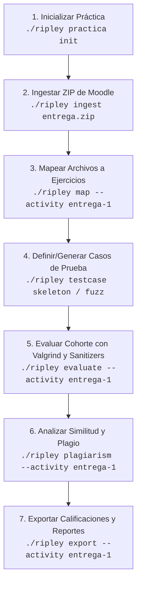

# Ripley CLI

> **Herramienta de automatización, análisis estático, ejecución dinámica, auditoría de memoria y calificación de entregas masivas en C para Programación I.**

`ripley` es una herramienta CLI en Python (gestionada con [`uv`](https://github.com/astral-sh/uv)) diseñada para la cátedra de **Programación I** de la Universidad Nacional de Río Negro (UNRN). Automatiza el ciclo completo de corrección docente sobre paquetes de entregas descargados desde Moodle: ingesta y sanitización de archivos, versionado incremental, mapeo interactivo de ejercicios, compilación segura, análisis de estilo y reglas de cátedra, ejecución de casos de prueba con control de límites de recursos, auditoría de memoria con Valgrind, análisis de plagio y generación de informes individuales y tableros consolidados.

---

## Características Principales

- **Ingesta Masiva y Resiliente desde Moodle:** Descomprime paquetes ZIP de Moodle, normaliza codificaciones erróneas, unifica estructuras de carpetas heterogéneas y detecta reentregas incrementales mediante hashes criptográficos (`sha256`).
- **Compilación Segura y Aislada:** Compilación archivo por archivo con `gcc`, aplicando sanitizadores (`-fsanitize=address,undefined`), advertencias estrictas (`-Wall`, `-Wextra`, `-pedantic`) y límites estrictos del sistema operativo (RLIMIT de CPU, RAM y tamaño de archivo generado) o aislamiento Bubblewrap.
- **Catálogo Oficial de Reglas de Programación I (P1 Rules):** Motor de verificación para el catálogo oficial de pautas (0x0001h a 0x3004h): identificadores descriptivos, tamaño de variables, espaciado de operadores, estructuras de control, tipos de datos, pasaje de punteros y buenas prácticas.
- **Análisis Estático y Linters de AST:** Inspección de código muerto, números mágicos, clones sintácticos internos, variables no inicializadas, conversiones de signo, const correctness, dangling stack pointers, sobreingeniería y más.
- **Ejecución Dinámica y Diagnósticos Pedagógicos:** Ejecución de casos de prueba (`.in`, `.out`, `.argv`) con comparación exacta, expresiones regulares y modo difuso (*fuzzy*). Intercepción didáctica de *Stack Overflow*, *Deadlock* en `scanf`, desbordamientos enteros (UBSan), *Use-After-Free* y fugas de memoria con Valgrind.
- **Generación de Diagramas Pedagógicos:**
  - **Diagramas de Flujo Tradicionales:** Genera notación ISO/ANSI en formatos Mermaid y Graphviz DOT.
  - **Topología de Memoria y Estructuras:** Modela `struct`s, campos, punteros y referencias enlazadas.
  - **Grafos de Invocación (Call Graph):** Visualiza dependencias entre funciones y resalta recursión.
- **Testing Avanzado:**
  - **Property-Based Testing:** Validación de propiedades matemáticas y estructurales (`idempotence`, `commutativity`, `sort_invariant`).
  - **Fuzzing Generativo:** Creación automática de casos de borde y pruebas diferenciales contra soluciones modelo.
  - **Auditoría de Funciones Puras:** Verificación de efectos colaterales y mutación de estado externo.
- **Detección de Plagio Cruzado:** Algoritmo *Winnowing* con tokenización semántica y huellas digitales de AST para identificar copias exactas o renombradas entre estudiantes.
- **Herramientas Personalizadas Arbitrarias (`[[custom_tools]]`):** Ejecución configurable de linters o scripts externos (`clang-tidy`, `flawfinder`, `splint`, etc.) por archivo fuente, binario o entrega.
- **Exportación Directa a Moodle:** Genera `moodle_grades.csv` para la planilla de calificaciones, `retroalimentacion_moodle.zip` con informes Markdown individuales y `dashboard.md` consolidado para los docentes.

---

## Requisitos del Sistema

- **Python:** 3.11 o superior.
- **Gestor de Paquetes:** [`uv`](https://docs.astral.sh/uv/)
- **Herramientas de Compilación y Diagnóstico:**
  - `gcc` / `clang`
  - `valgrind`
  - `cppcheck` (opcional)
  - `graphviz` (`dot`, opcional para renderizar diagramas)

---

## Instalación y Configuración

1. Clonar el repositorio:
   ```bash
   git clone https://github.com/INGCOM-UNRN-P1/ripley.git
   cd ripley
   ```

2. Sincronizar el entorno y dependencias con `uv`:
   ```bash
   uv sync
   ```

3. Verificar la instalación:
   ```bash
   ./ripley --help
   ```

---

## Flujo de Trabajo Docente Recomendado



---

## Guía Rápida de Comandos CLI

| Comando | Descripción |
| :--- | :--- |
| `./ripley practica init` | Crea la estructura de una práctica docente con enunciados, soluciones y tests. |
| `./ripley practica list` | Lista las prácticas docentes configuradas en `./practicas/`. |
| `./ripley ingest <zip>` | Ingesta y versiona entregas masivas desde un ZIP de Moodle. |
| `./ripley map` | Asocia interactivamente los archivos `.c` entregados con los ejercicios correspondientes. |
| `./ripley testcase skeleton` | Genera plantillas vacías de casos de prueba (`.in`, `.out`, `.argv`). |
| `./ripley testcase fuzz` | Genera casos de borde aleatorios y diferenciales contra la solución de referencia. |
| `./ripley evaluate` | Ejecuta la evaluación completa de compilación, estilo, Valgrind, tests e informes. |
| `./ripley plagiarism` | Analiza similitud semántica y sospecha de copias en la cohorte. |
| `./ripley flowchart` | Genera diagramas de flujo ISO/ANSI en Mermaid o DOT a partir de código C. |
| `./ripley callgraph` | Extrae el grafo de llamadas entre funciones y detecta recursión. |
| `./ripley memory-visualize` | Genera diagramas de estructuras dinámicas y `struct`s en memoria. |
| `./ripley pure-audit` | Analiza funciones en busca de efectos de lado e impurezas. |
| `./ripley property-test` | Ejecuta arneses de invariantes formales sobre funciones C. |
| `./ripley export` | Genera el CSV de notas para Moodle, el ZIP de retroalimentaciones y el tablero. |

Para conocer todas las opciones y comandos avanzados, consultá el archivo [MANUAL.md](MANUAL.md).

---

## Configuración Modular (`ripley.toml`)

El comportamiento de Ripley se configura globalmente o por práctica (`practicas/<slug>/ripley.toml`):

```toml
[compiler]
enabled = true
executable = "gcc"
flags = ["-Wall", "-Wextra", "-pedantic", "-std=c11", "-fsanitize=address,undefined"]

[limits]
timeout_segundos = 5.0
limite_memoria_mb = 128

[style]
enabled = true
brace_style = "allman"
require_braces = true
indent_style = "spaces"
indent_size = 4

[p1_rules]
enabled = true

[valgrind]
enabled = true
flags = ["--leak-check=full", "--show-leak-kinds=all", "--track-origins=yes"]

[rubric]
peso_compilacion = 0.30
peso_linter = 0.20
peso_estilo = 0.10
peso_pruebas = 0.40

# Herramientas CLI personalizadas
[[custom_tools]]
name = "clang-tidy"
command = "clang-tidy {source} -- -std=c11"
enabled = false
stage = "source"
```

---

## Ejecución de Pruebas y QA

Ripley cuenta con una suite completa de pruebas unitarias y de integración:

```bash
uv run pytest -v
```

---

## Documentación Adicional

- 📖 [Manual de Referencia Técnica Completa (`MANUAL.md`)](file:///home/mrtin/dev/p1/ripley/MANUAL.md)
- 🛠️ [Guía de Configuración de Herramientas Externas para C (`HERRAMIENTAS_EXTERNAS.md`)](file:///home/mrtin/dev/p1/ripley/HERRAMIENTAS_EXTERNAS.md)

---

## Licencia

Desarrollado para la cátedra de **Programación I** - **Universidad Nacional de Río Negro (UNRN)**.
Uso interno académico y docente.

